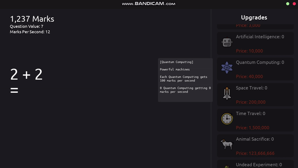

# Solv

Solv was made as a school project to help people build their arithmetic skills, while also having fun. My job for this task was to remake the prototype I made with an engine into Java.

---

The concept is that you must solve math equations to earn marks which are then used to spend on upgrades to help progress the player further.

---

### Screenshots

### Download
